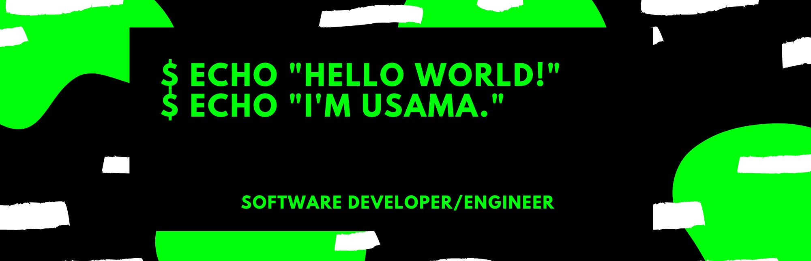

<h3> My Development Toolkit </h3>

<!-- Python -->

<!-- R -->

<!-- HTML -->

<!-- CSS -->

<!-- JavaScript -->

<!-- TypeScript -->

<!-- SQL -->

<!-- Markdown -->

<!-- LaTeX -->

<!-- BootStrap -->

<!-- Angular -->

<!-- Vue -->

<!-- React -->

<!-- WebPack -->

<!-- Django -->

<!-- Docker -->

<!-- Kubernetes -->

<!-- Vim -->

<!-- VSCode -->

<!-- JetBrains -->

<!-- Git -->

<!-- BitBucket -->

<!-- Linux -->

<!-- Windows -->

<!--
**Usamasajjad/Usamasajjad** is a ✨ _special_ ✨ repository because its `README.md` (this file) appears on your GitHub profile.

Here are some ideas to get you started:

- 🔭 I’m currently working on ...
- 🌱 I’m currently learning ...
- 👯 I’m looking to collaborate on ...
- 🤔 I’m looking for help with ...
- 💬 Ask me about ...
- 📫 How to reach me: ...
- 😄 Pronouns: ...
- ⚡ Fun fact: ...
-->
